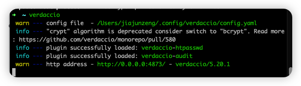
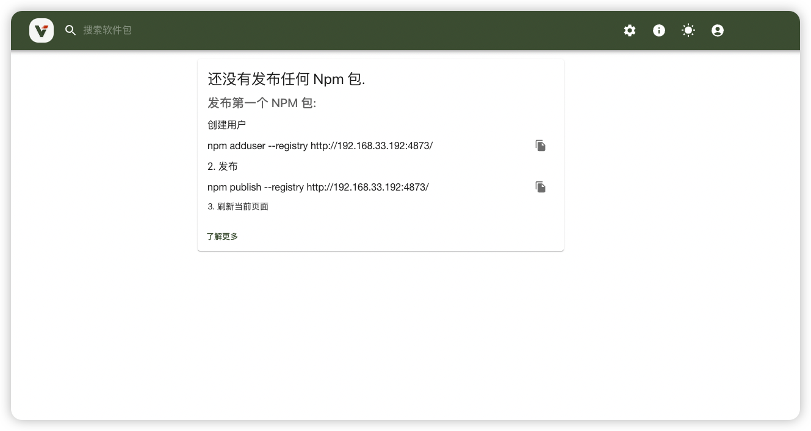

# 使用 verdaccio 搭建 npm 私服

## 安装 verdaccio

```
npm i verdaccio -g
```

## 启动 verdaccio

```
# 直接启动
verdaccio
# 通过 pm2 启动
pm2 start verdaccio
```

Verdaccio 启动成功如下：



## verdaccio 配置文件

可配置权限访问，端口号等
https://verdaccio.org/docs/configuration
config.yaml

```
#
# This is the default configuration file. It allows all users to do anything,
# please read carefully the documentation and best practices to
# improve security.
#
# Look here for more config file examples:
# https://github.com/verdaccio/verdaccio/tree/5.x/conf
#
# Read about the best practices
# https://verdaccio.org/docs/best

# path to a directory with all packages
storage: /Users/jiajunzeng/.local/share/verdaccio/storage
# path to a directory with plugins to include
plugins: ./plugins

# https://verdaccio.org/docs/webui
web:
  title: Verdaccio
  # comment out to disable gravatar support
  # gravatar: false
  # by default packages are ordercer ascendant (asc|desc)
  # sort_packages: asc
  # convert your UI to the dark side
  # darkMode: true
  # html_cache: true
  # by default all features are displayed
  # login: true
  # showInfo: true
  # showSettings: true
  # In combination with darkMode you can force specific theme
  # showThemeSwitch: true
  # showFooter: true
  # showSearch: true
  # showRaw: true
  # showDownloadTarball: true
  #  HTML tags injected after manifest <scripts/>
  # scriptsBodyAfter:
  #    - '<script type="text/javascript" src="https://my.company.com/customJS.min.js"></script>'
  #  HTML tags injected before ends </head>
  #  metaScripts:
  #    - '<script type="text/javascript" src="https://code.jquery.com/jquery-3.5.1.slim.min.js"></script>'
  #    - '<script type="text/javascript" src="https://browser.sentry-cdn.com/5.15.5/bundle.min.js"></script>'
  #    - '<meta name="robots" content="noindex" />'
  #  HTML tags injected first child at <body/>
  #  bodyBefore:
  #    - '<div id="myId">html before webpack scripts</div>'
  #  Public path for template manifest scripts (only manifest)
  #  publicPath: http://somedomain.org/

# https://verdaccio.org/docs/configuration#authentication
auth:
  htpasswd:
    file: ./htpasswd # 用户信息文件
    max_users: 2 # 设置最多用户数量，-1 表示不允许新建用户
    # Maximum amount of users allowed to register, defaults to "+inf".
    # You can set this to -1 to disable registration.
    # max_users: 1000
    # Hash algorithm, possible options are: "bcrypt", "md5", "sha1", "crypt".
    # algorithm: bcrypt # by default is crypt, but is recommended use bcrypt for new installations
    # Rounds number for "bcrypt", will be ignored for other algorithms.
    # rounds: 10

# https://verdaccio.org/docs/configuration#uplinks
# a list of other known repositories we can talk to
uplinks:
  npmjs:
    url: https://registry.npm.taobao.org/ # npm 上链地址，如果私服找不到，会从该地址安装包

# Learn how to protect your packages
# https://verdaccio.org/docs/protect-your-dependencies/
# https://verdaccio.org/docs/configuration#packages
packages:
  '@*/*': # 包匹配，可以设置一些自己命名的私有包，如 'private-‘：
    # scoped packages
    access: $all  # 所有人都可以安装包
    publish: $authenticated # 只有认证的账号可以发包
    unpublish: admin # 只允许 admin 删除包
    proxy: npmjs # 代理，如果找不到包，会从 uplinks-npmjs 安装

  '**':
    # allow all users (including non-authenticated users) to read and
    # publish all packages
    #
    # you can specify usernames/groupnames (depending on your auth plugin)
    # and three keywords: "$all", "$anonymous", "$authenticated"
    access: $all

    # allow all known users to publish/publish packages
    # (anyone can register by default, remember?)
    publish: $authenticated
    unpublish: admin

    # if package is not available locally, proxy requests to 'npmjs' registry
    proxy: npmjs

# To improve your security configuration and  avoid dependency confusion
# consider removing the proxy property for private packages
# https://verdaccio.org/docs/best#remove-proxy-to-increase-security-at-private-packages

# https://verdaccio.org/docs/configuration#server
# You can specify HTTP/1.1 server keep alive timeout in seconds for incoming connections.
# A value of 0 makes the http server behave similarly to Node.js versions prior to 8.0.0, which did not have a keep-alive timeout.
# WORKAROUND: Through given configuration you can workaround following issue https://github.com/verdaccio/verdaccio/issues/301. Set to 0 in case 60 is not enough.
server:
  keepAliveTimeout: 60
  # Allow `req.ip` to resolve properly when Verdaccio is behind a proxy or load-balancer
  # See: https://expressjs.com/en/guide/behind-proxies.html
  # trustProxy: '127.0.0.1'

# https://verdaccio.org/docs/configuration#offline-publish
# publish:
#   allow_offline: false

# https://verdaccio.org/docs/configuration#url-prefix
# url_prefix: /verdaccio/
# VERDACCIO_PUBLIC_URL='https://somedomain.org';
# url_prefix: '/my_prefix'
# // url -> https://somedomain.org/my_prefix/
# VERDACCIO_PUBLIC_URL='https://somedomain.org';
# url_prefix: '/'
# // url -> https://somedomain.org/
# VERDACCIO_PUBLIC_URL='https://somedomain.org/first_prefix';
# url_prefix: '/second_prefix'
# // url -> https://somedomain.org/second_prefix/'

# https://verdaccio.org/docs/configuration#security
# security:
#   api:
#     legacy: true
#     jwt:
#       sign:
#         expiresIn: 29d
#       verify:
#         someProp: [value]
#    web:
#      sign:
#        expiresIn: 1h # 1 hour by default
#      verify:
#         someProp: [value]

# https://verdaccio.org/docs/configuration#user-rate-limit
# userRateLimit:
#   windowMs: 50000
#   max: 1000

# https://verdaccio.org/docs/configuration#max-body-size
# max_body_size: 10mb

# https://verdaccio.org/docs/configuration#listen-port
listen: 0.0.0.0:4873 # 网络地址监听
# listen:
# - localhost:4873            # default value
# - http://localhost:4873     # same thing
# - 0.0.0.0:4873              # listen on all addresses (INADDR_ANY)
# - https://example.org:4873  # if you want to use https
# - "[::1]:4873"                # ipv6
# - unix:/tmp/verdaccio.sock    # unix socket

# The HTTPS configuration is useful if you do not consider use a HTTP Proxy
# https://verdaccio.org/docs/configuration#https
# https:
#   key: ./path/verdaccio-key.pem
#   cert: ./path/verdaccio-cert.pem
#   ca: ./path/verdaccio-csr.pem

# https://verdaccio.org/docs/configuration#proxy
# http_proxy: http://something.local/
# https_proxy: https://something.local/

# https://verdaccio.org/docs/configuration#notifications
# notify:
#   method: POST
#   headers: [{ "Content-Type": "application/json" }]
#   endpoint: https://usagge.hipchat.com/v2/room/3729485/notification?auth_token=mySecretToken
#   content: '{"color":"green","message":"New package published: * {{ name }}*","notify":true,"message_format":"text"}'

middlewares:
  audit:
    enabled: true

# https://verdaccio.org/docs/logger
# log settings
logs: { type: stdout, format: pretty, level: http }
#experiments:
#  # support for npm token command
#  token: false
#  # disable writing body size to logs, read more on ticket 1912
#  bytesin_off: false
#  # enable tarball URL redirect for hosting tarball with a different server, the tarball_url_redirect can be a template string
#  tarball_url_redirect: 'https://mycdn.com/verdaccio/${packageName}/${filename}'
#  # the tarball_url_redirect can be a function, takes packageName and filename and returns the url, when working with a js configuration file
#  tarball_url_redirect(packageName, filename) {
#    const signedUrl = // generate a signed url
#    return signedUrl;
#  }

# translate your registry, api i18n not available yet
# i18n:
# list of the available translations https://github.com/verdaccio/verdaccio/blob/master/packages/plugins/ui-theme/src/i18n/ABOUT_TRANSLATIONS.md
#   web: en-US
```

htpasswd

```
admin:vnJA/UiK4DRv6:autocreated 2023-01-30T07:55:09.853Z
batar:656gTYGKVn26Y:autocreated 2023-01-30T07:55:27.268Z
```

## 发包流程

```
npm config set regisgry ip:port
npm adduser # 注册用户，注册成功会直接登录;
npm login # 登录用户，已有账号可直接登录
npm publish # 发包
npm unpublish packagename # 删除包

# 可使用 npm link 做一些包开发调试
```

## pm2 了解

https://pm2.keymetrics.io/docs/usage/quick-start/

```
# 启动
pm2 start app.js
# 列表
pm2 list
# 停止
pm2 stop process_id
# 删除
pm2 delete process_id
# 重启
pm2 restart process_id
```

```
# Fork mode
pm2 start app.js --name my-api # Name process# Cluster mode
pm2 start app.js -i 0        # Will start maximum processes with LB depending on available CPUs
pm2 start app.js -i max      # Same as above, but deprecated.
pm2 scale app +3             # Scales `app` up by 3 workers
pm2 scale app 2              # Scales `app` up or down to 2 workers total# Listing

pm2 list               # Display all processes status
pm2 jlist              # Print process list in raw JSON
pm2 prettylist         # Print process list in beautified JSON

pm2 describe 0         # Display all information about a specific process

pm2 monit              # Monitor all processes# Logs

pm2 logs [--raw]       # Display all processes logs in streaming
pm2 flush              # Empty all log files
pm2 reloadLogs         # Reload all logs# Actions

pm2 stop all           # Stop all processes
pm2 restart all        # Restart all processes

pm2 reload all         # Will 0s downtime reload (for NETWORKED apps)

pm2 stop 0             # Stop specific process id
pm2 restart 0          # Restart specific process id

pm2 delete 0           # Will remove process from pm2 list
pm2 delete all         # Will remove all processes from pm2 list# Misc

pm2 reset <process>    # Reset meta data (restarted time...)
pm2 updatePM2          # Update in memory pm2
pm2 ping               # Ensure pm2 daemon has been launched
pm2 sendSignal SIGUSR2 my-app # Send system signal to script
pm2 start app.js --no-daemon
pm2 start app.js --no-vizion
pm2 start app.js --no-autorestart
```
