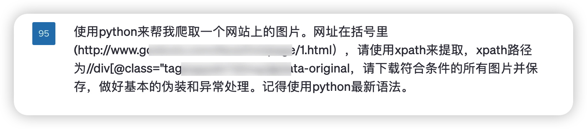
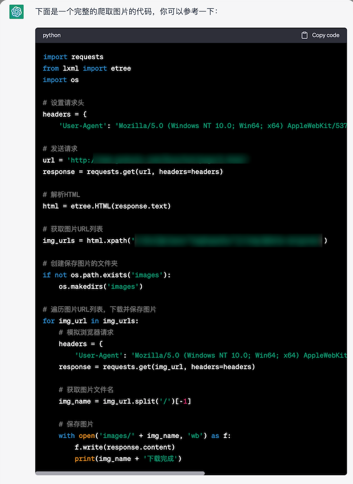
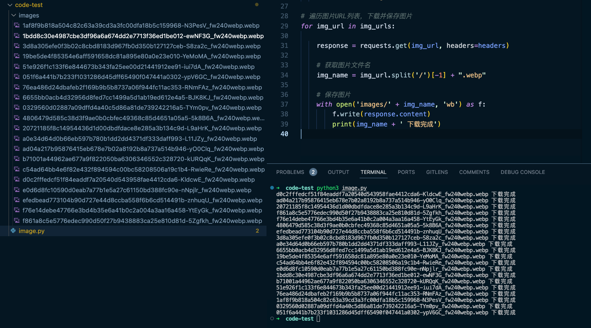

# 五分钟实现一个 Python 图片爬虫

## ChatGpt 实现




## 源码

```python
import requests
from lxml import etree
import os

# 设置请求头
headers = {
    'User-Agent': 'Mozilla/5.0 (Windows NT 10.0; Win64; x64) AppleWebKit/537.36 (KHTML, like Gecko) Chrome/58.0.3029.110 Safari/537.3'}

# 发送请求
url = 'https:xxx'
response = requests.get(url, headers=headers)

# 解析HTML
html = etree.HTML(response.text)

# 获取图片URL列表
img_urls = html.xpath('xxx')


# 创建保存图片的文件夹
if not os.path.exists('images'):
    os.makedirs('images')

# 遍历图片URL列表，下载并保存图片
for img_url in img_urls:

    response = requests.get(img_url, headers=headers)

    # 获取图片文件名
    img_name = img_url.split('/')[-1] + ".webp"

    # 保存图片
    with open('images/' + img_name, 'wb') as f:
        f.write(response.content)
        print(img_name + ' 下载完成')

```

## 实现效果



## 参考链接

ChatGpt
