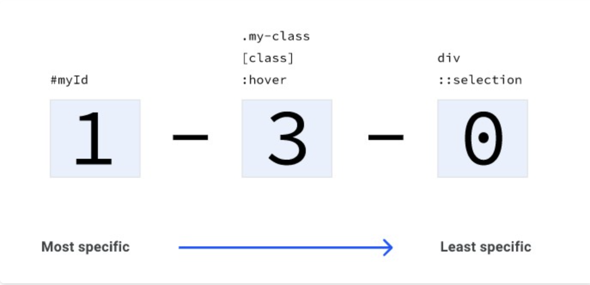

# Css 权重计算规则

**CSS：Cascading Stylesheets（层叠样式表，也叫级联样式表）**

## 级联（层叠）算法可以分为以下四个模块：

1. **位置和出现的顺序**：css 规则出现的顺序。
2. **特征性（具体性 Specificity）**：确定 css 选择器具有最高匹配权的算法。
3. **来源**： css 在何时何处生成。它是否是一个浏览器样式或者是浏览器插件添加的样式，又或者是你写的 css 代码。
4. **重要性**：一些 css 规则具有更高的重要性，特别是包含!important 值的规则。

## **一：位置和出现的顺序**

link，style 样式**越靠后权重越高**，但是不适用于內联样式（通过元素 style 属性定义的样式，**内联样式会覆盖所有其他的 css**，无论这些 css 出现的位置和顺序，除非 css 规则的声明值定义为!important，!important 比内联样式的重要性更高。）

```css
<style>
button {
  color: yellow;
}
button {
  color: red;
}
</style>

<button>这里是红色的按钮</button>
```

## **二：特征性（具体性 Specificity）**

特征性是一种决定哪个 css 选择器最具体的算法。这里的最具体的意思，你可以看成哪个 css 权重最高的意思，选择器权重最高的 css 规则，在规则冲突中将会胜出。
有了特征性算法，即使有多个不同的 css 规则具有不同的选择器产生了规则冲突，浏览器也可以决定最后使用哪个 css 规则去渲染页面。

### **1. 特征性分数（权重）**

比较两个选择器的特征性（权重）大小，实际上是计算两个选择器的分数（权重，后面我统称权重），**权重大的将会在规则冲突中胜出**。

#### 通配选择器：0

#### 类型（标签）选择器和伪元素选择器：1

#### 类选择器、伪类选择器和属性选择器：10

#### ID 选择器：100

#### 内联样式：1000

#### !important：10000

### **2. 权重的累加**

一个选择器的权重分数是累加计算的。

```css
// 假设有如下html：
<a class="my-class another-class" href="#">A link</a>

/* 权重为 1 */
a {
  color: red;
}

/* 加一个类使选择器，权重为 11 */
a.my-class {
  color: green;
}

/* 再添加一个类名，权重为 21 */
a.my-class.another-class {
  color: rebeccapurple;
}

/* 在上面的基础上，添加一个属性，权重为 31 */
a.my-class.another-class[href] {
  color: goldenrod;
}

/* 添加一个伪类，权重为 41 */
a.my-class.another-class[href]:hover {
  color: lightgrey;
}
```

### **3. 可视化特征性**

至此你应该知道了如何去计算一个选择性的权重（分数）。如何去写一个规则覆盖另一个规则。下面的示意图很好的总结了各类型选择器的权重（分数）。

最左侧是 id 选择器，中间是类选择器、属性选择器和伪类选择器，最后面是元素选择器和伪元素选择器。
如果用图中的格式描述权重，下面的权重为 0-4-1:

```css
a.my-class.another-class[href]:hover {
  color: lightgrey;
}
```

## **三：来源**

css 来自不同的地方，也会影响是否会在规则冲突中胜出。关于样式的来源的特征性从低到高如下：

1. 用户代理样式：也就是浏览器默认样式。
2. 本地用户样式：一般来源于系统设定，也可以是浏览器插件设定的样式。某些浏览器插件允许用户定义自己的浏览器页面样式。
3. 开发者定义的 css 规则：指网页开发者写下的 css 样式。
4. 标记为!important 的 css: 网页开发者写的含!important 标记的 css 样式。
5. 含!important 的本地用户样式：与 2 来源相同，不过这个 css 含有!important 标记。
6. 含!important 的用户代理样式：与 1 来源相同，不过这个 css 含有!important 标记。

## **四：重要性**

并不是所有的 css 规则都和其他 css 按照同样方式计算特征性。
不同种类的 css 规则重要性**从低到高**依次如下：

1. 普通规则：例如 font-size、background 或者 color。
2. animation 规则。
3. !important 规则。
4. transition 规则。

所以当某些动画规则或者变换规则激活时，它会取代普通规则，进行渲染页面。

## 参考链接

1. [学习参考](https://web.dev/learn/css/)
2. [中文翻译](https://pengfeixc.com/tutorial/css/specificity)
