# Vue3 的基本用法总结

该页面假设你已经阅读过了 [Vue2 的基本用法总结](/Vue2%20的基本用法总结/index.md)。如果你还对 Vue2 不太了解，推荐你先阅读它。

```
❗️❗️
Vue3.0 相比 Vue2.0 的写法区别主要有 🚀

1. Vue3.0 的响应式声明使用的是 ref，reactive 等 API 声明的
2. Vue3.0 使用 template 实现 for 循环的时候，key 值是绑定在 template 上的
3. computed，watch 也都是通过 API 来使用，还多了一些 watchEffect 等，可以参考官网
4. v-model 在实现组件封装上比 Vue2.0 更灵活了，如 v-model:value, v-model:visible 等
5. 对 ref 的引用，vue2 是通过 this.$refs 来获取，vue3 是通过 ref 变量绑定来获取
6. 属性（props）和组件事件通信（emit) 分别使用 defineProps, defineEmits 来定义
7. script 的 setup 语法糖是真好用 💯🔥

......
```

## **声明式渲染**

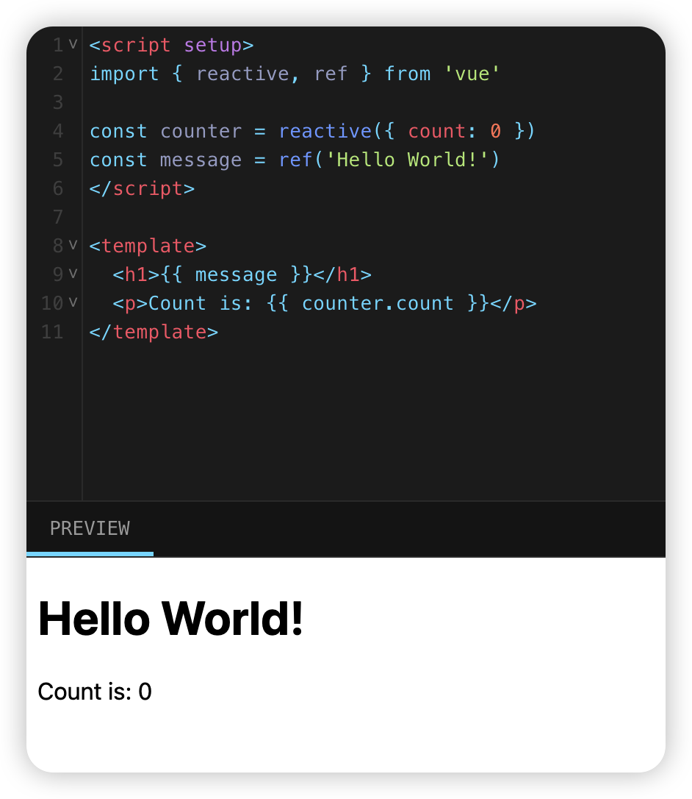

## **Attribute 绑定**

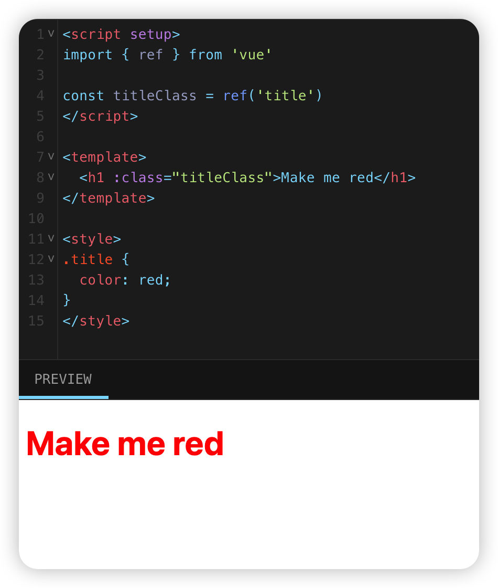

## **事件监听**

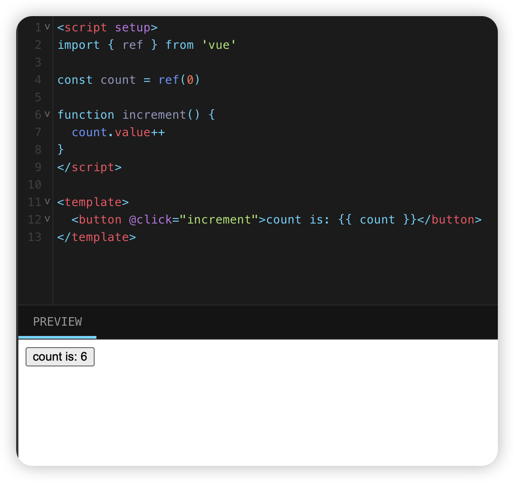

## **v-model 双向绑定**

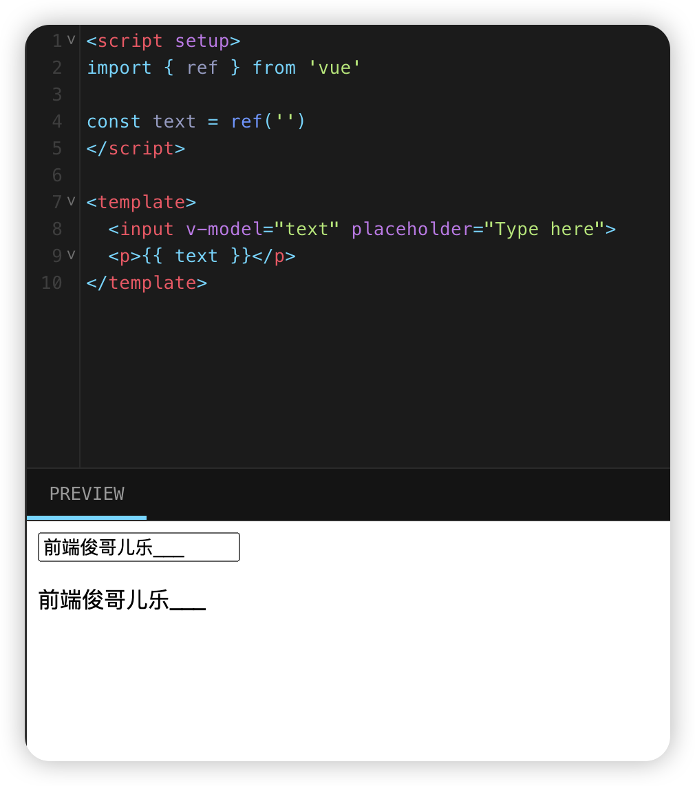

## **条件渲染**

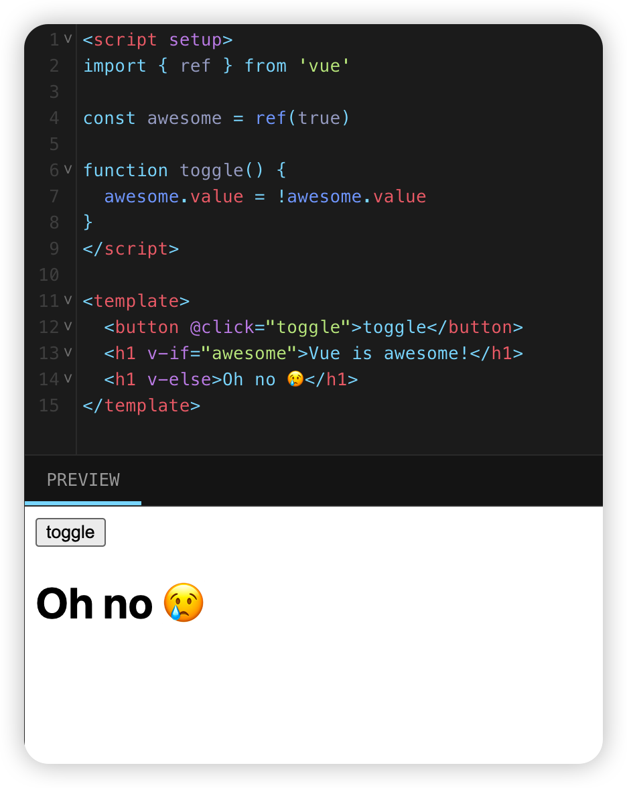

## **列表渲染**

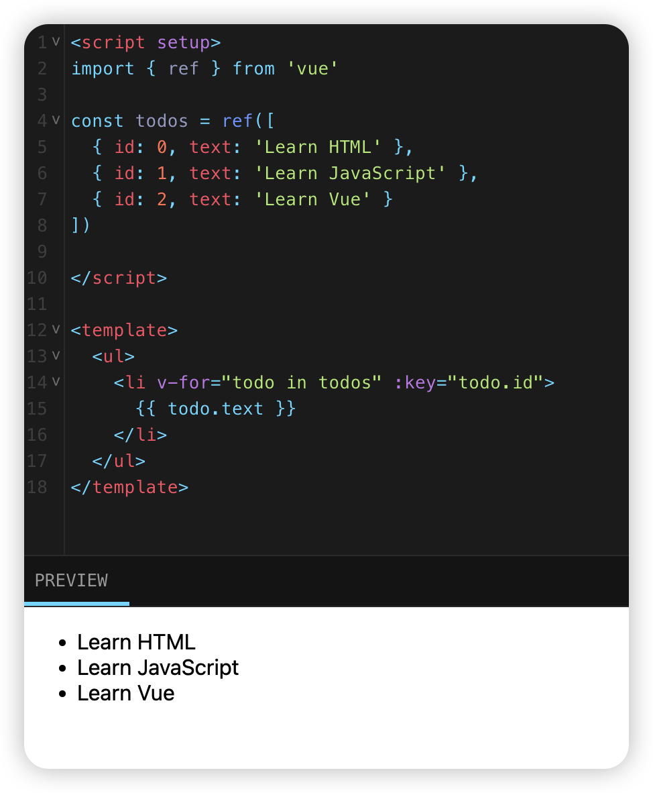

## **计算属性（computed)**

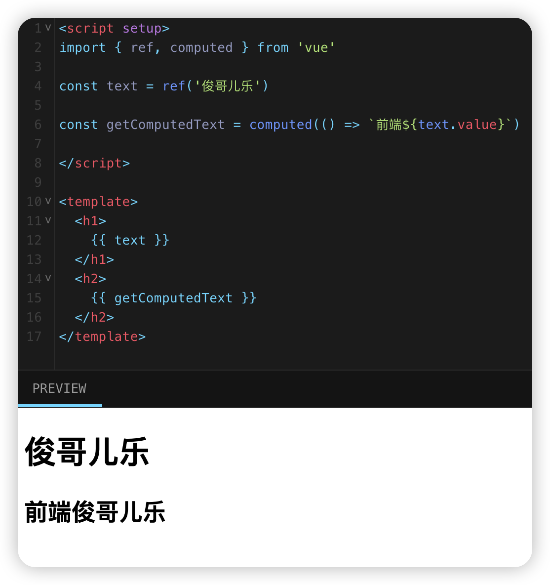

## **生命周期与模版引用**

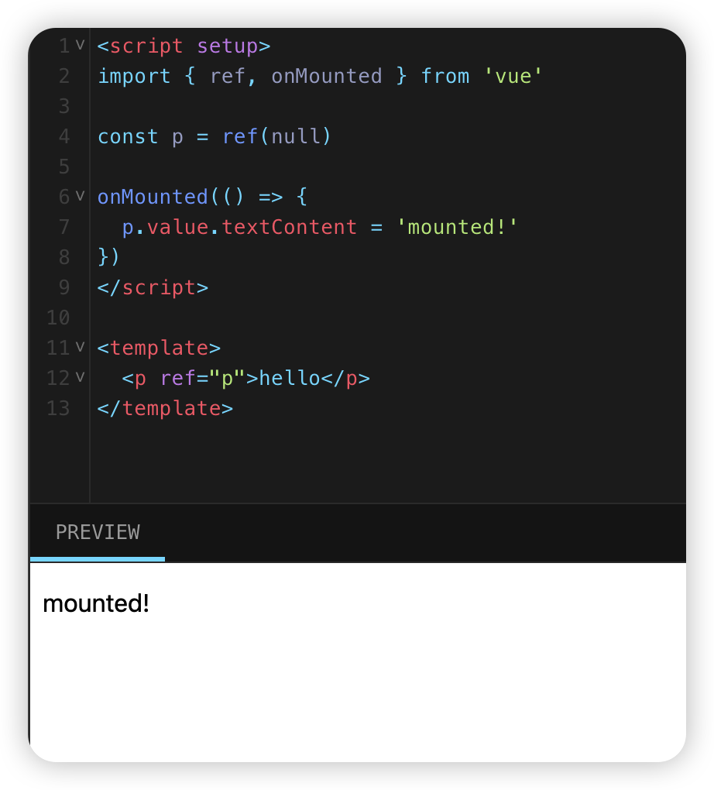

## **监听器（watch）**


## **引入组件**

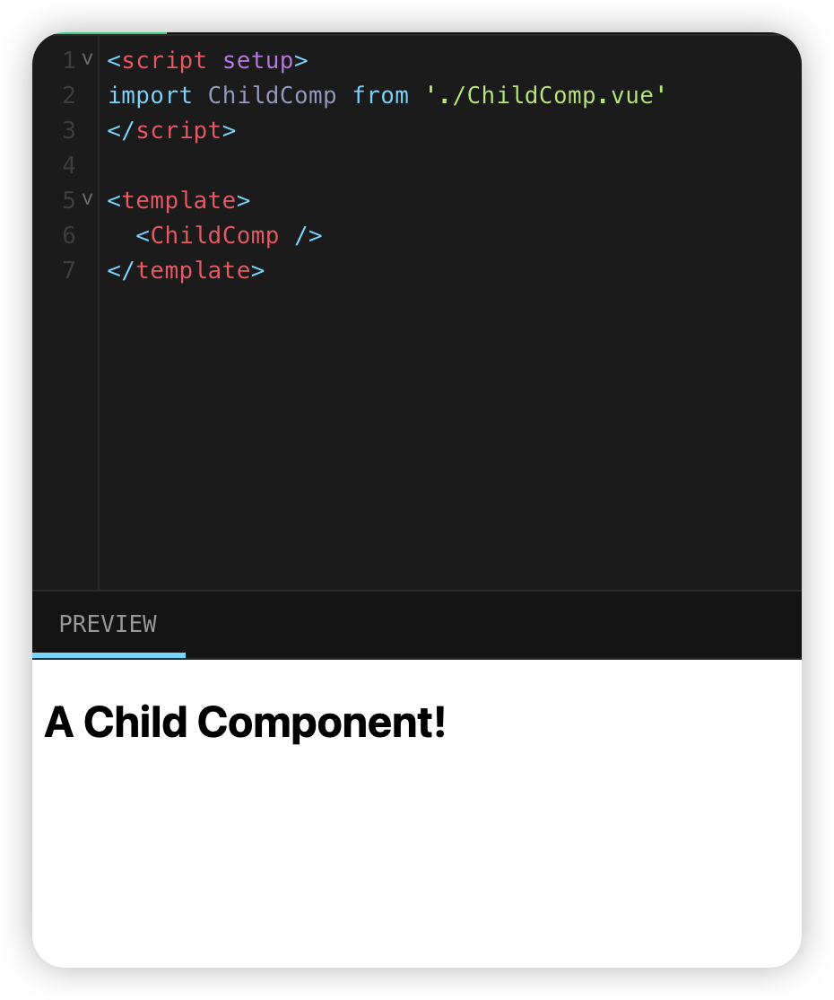

## **属性传值**

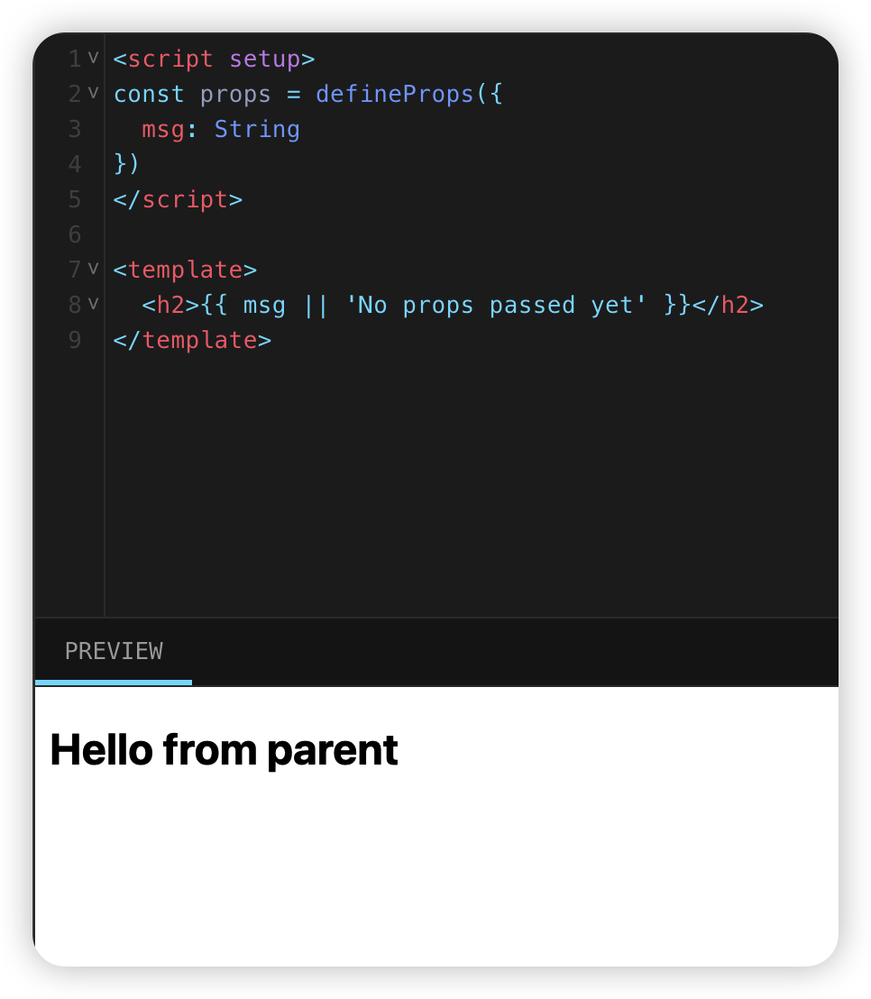

## **事件通信**

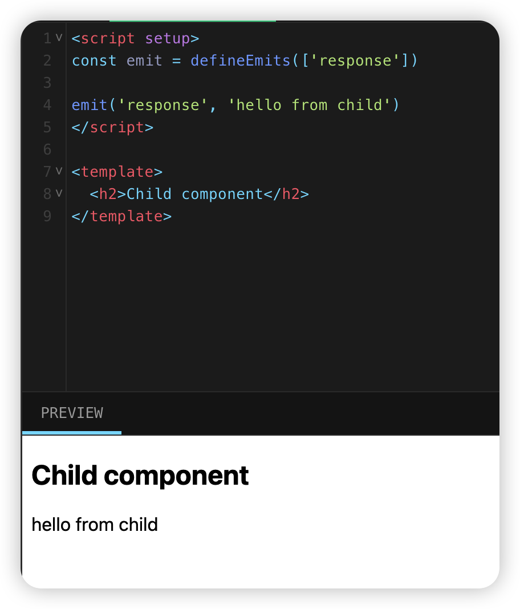

## **插槽**

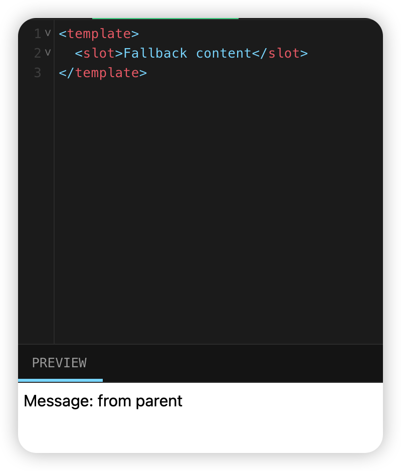

## 参考链接

[教程 | Vue.js](https://cn.vuejs.org/tutorial/#step-1)
