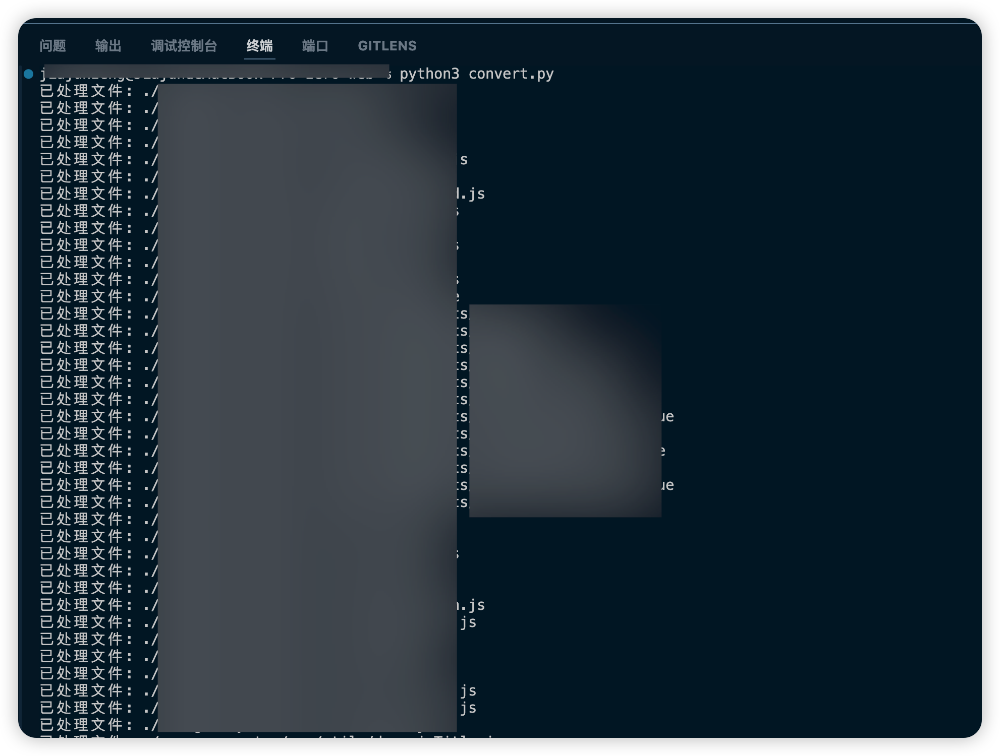
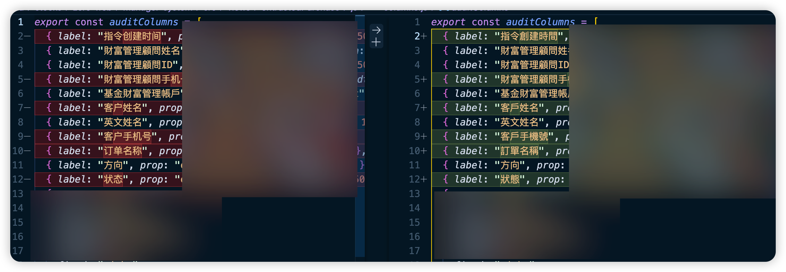

# 一行命令将项目代码转换成繁体

## 业务背景

不知道大家是不是有收到过类似的需求，就是将项目中的代码从简体转换成繁体，或者反过来。
如果有，那么这个脚本就是为你准备的。

## 安装

```bash
pip3 install zhconv
```

## 使用方法

```bash
python3 ./convert.py
```

## convert.py

```python
import os
import zhconv

def simplify_to_traditional(root_dir):
  for dirpath, dirnames, filenames in os.walk(root_dir):
    for filename in filenames:
      if filename.endswith(('.txt', '.md', '.js', '.html', '.css', ".vue")):
        filepath = os.path.join(dirpath, filename)
        with open(filepath, 'r', encoding='utf-8') as file:
          content = file.read()
        
        converted_content = zhconv.convert(content, 'zh-hant') # 转换为繁体
        # converted_content = zhconv.convert(content, 'zh-cn') # 转换为简体
        
        with open(filepath, 'w', encoding='utf-8') as file:
          file.write(converted_content)
        
        print(f"已处理文件: {filepath}")  

# 使用示例
root_directory = 'path/to/your/project'
simplify_to_traditional(root_directory)
```

## 效果



