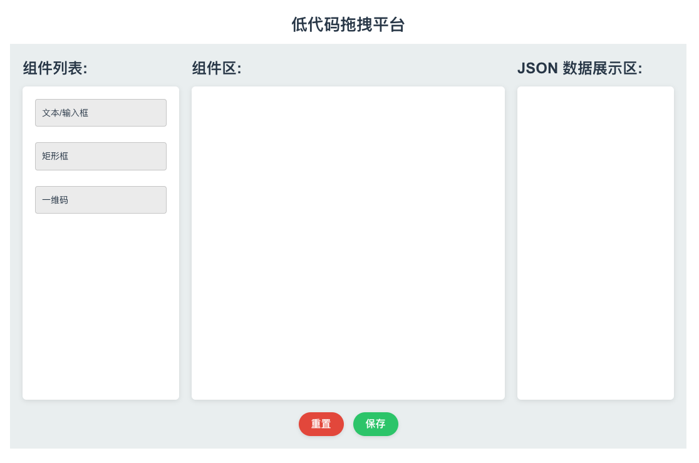

# 使用 ChatGpt 生成了一个简简简易低代码

## 说明

`该项目就是一个菜鸟开发所做的一件好奇的事儿 ~`

`仅仅是因为好奇做的一件事情 ~`

`仅仅是因为想记录而记录而记录而记录的一篇日记 ~`

## 提示词

**这是我当时写的一些提示词**（~~乱写一通~~）

`帮我实现一个 VUE3 组件，UI 框架是 ArcoDesign，我想要实现的功能是一个低代码平台，左侧是一些组件，可以是【文本类型，矩形，一维码】，右侧是可视化区域，如果拖入的是文本类型，那么他可以手动输入文本并且可以调整字体大小，并且如果用户输入的是 "{{ field }}"，里边的 filed 是一个值占位，是后续用来动态绑定值的，不应该将其作为纯文本； 如果拖入的是矩形，那么他可以通过拖拽来是实现放大缩小；如果是一维码，需要可以自定义宽度。右侧可视化区域的宽度和高度是可以让我动态设置的，需要有重置和保存，当我点保存时，需要给我输出一份 JSON 对象，要描述好当前配置的信息，JSON 数据对象结构可以参考如下 [ { type: "text", fontSize: "12", value: "测试一下", x: "", y: "" }, { type: "filed", fontSize: "12", field: "ticketNo", x: "", y: ""}, {type: "square", xLeft: "", yLeft: "", xRight: "", yRight: ""} ]`

`使用 VUE3.0 的 setup 语法糖实现一个左右布局，为低代码平台做准备的，左侧是组件区，右侧是展示操作区`

---

最终经过各种修改 -> 修改 -> 修改 -> ...

---

生成如下：

## 成果展示

## [源码地址](https://github.com/jungeer/lowcode-gpt4)

## [在线地址](https://jungeer.github.io/lowcode-gpt4)
