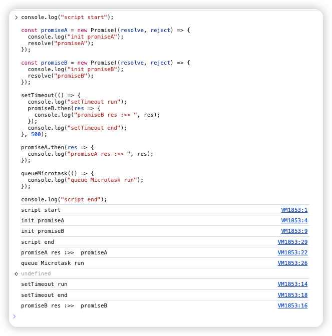

# 浏览器的宏任务与微任务

## 浏览器的事件循环机制

首先要知道一件事，JavaScript 是单线程的（指的是 js 引擎在执行代码的时候只有一个主线程，每次只能干一件事），同时还是非阻塞运行的（执行异步任务的时候，会先挂起相应任务，待异步返回结果再执行回调），这就要知道其事件的循环机制才能正确理解 js 代码的执行顺序。

在 js 代码执行时，会将对象存在堆（heap）中，在栈（stack）中存放一些基础类型变量和对象的指针。在执行方法时，会根据当前方法的执行上下文，来进行一个执行。对于普通函数就是正常的入栈出栈即可，涉及到异步任务的时候，js 执行会将对应的任务放到事件队列中（微任务队列、宏任务队列）。

- <strong style="color: red">常见微任务：</strong> queueMicrotask、Promise、MutationObserve 等。
- <strong style="color: red">常见宏任务：</strong> ajax、setTimeout、setInterval、script（js 整体代码）、IO 操作、UI 交互、postMessage 等。

故事件循环可以理解为是一个桥梁，连接着应用程序的 js 和系统调用之间的通道。其过程为：

1. 执行一个宏任务（一般为一段 script），若没有可选的宏任务，就直接处理微任务。
2. 执行中遇到微任务，就将其添加到微任务的任务队列中。
3. 执行中遇到宏任务，就将其提交到宏任务队列中。
4. 执行完当前执行的宏任务后，去查询当前有无需要执行的微任务，有就执行。
5. 检查渲染，若需要渲染，浏览器执行渲染任务。
6. 渲染完毕后，Js 线程会去执行下一个宏任务。

（如此循环）

## 代码示例

```javascript
console.log("script start");

const promiseA = new Promise((resolve, reject) => {
  console.log("init promiseA");
  resolve("promiseA");
});

const promiseB = new Promise((resolve, reject) => {
  console.log("init promiseB");
  resolve("promiseB");
});

setTimeout(() => {
  console.log("setTimeout run");
  promiseB.then((res) => {
    console.log("promiseB res :>> ", res);
  });
  console.log("setTimeout end");
}, 500);

promiseA.then((res) => {
  console.log("promiseA res :>> ", res);
});

queueMicrotask(() => {
  console.log("queue Microtask run");
});

console.log("script end");

// script start
// init promiseA
// init promiseB
// script end
// promiseA res :>>  promiseA
// queue Microtask run
// setTimeout run
// setTimeout end
// promiseB res :>>  promiseB
```


