# 记一次 React-Taro 配置错误&编译体积过大

## tsconfig 配置出现错误提示

### 正确配置

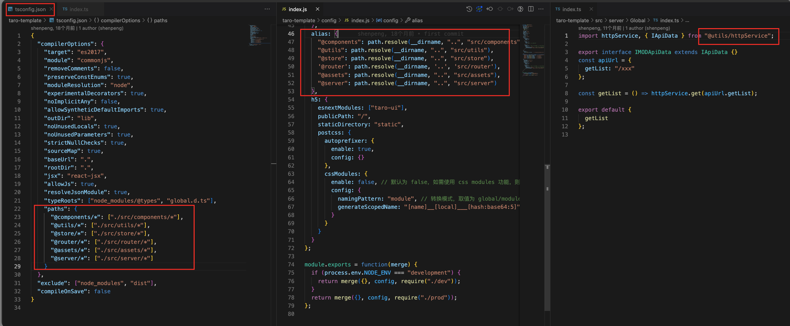

### 错误配置

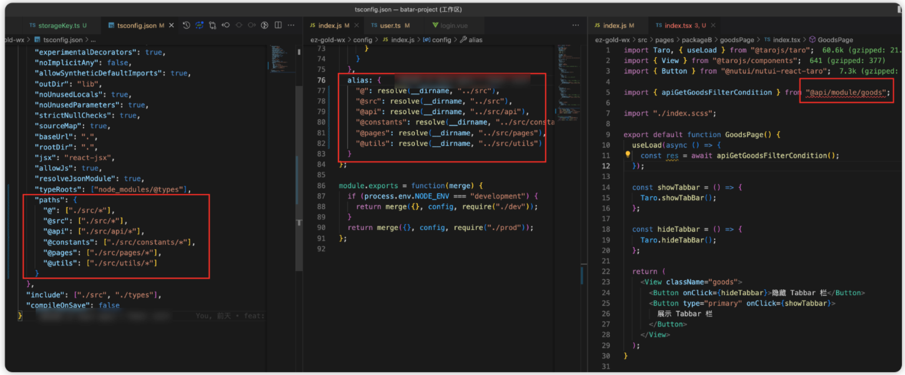

### **解决方案**

key value 值需要对应完整，之前漏了 “\*”

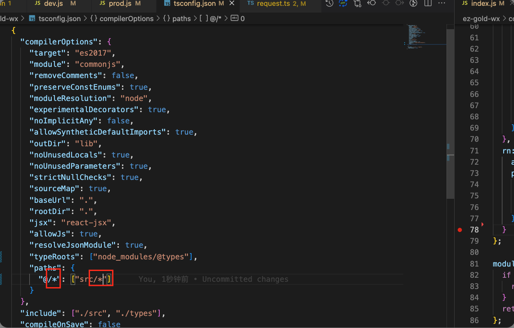

## 导入出现错误提示

### 错误提示

```bash
at HarmonyImportSpecifierDependency.getLinkingErrors (/Users/project/node_modules/webpack/lib/dependencies/HarmonyImportDependency.js:160:8)
ModuleDependencyWarning: export 'default' (imported as 'GoodsPage') was not found in '../imgs/../imgs/packageB/Test/index' (module has no exports)
```

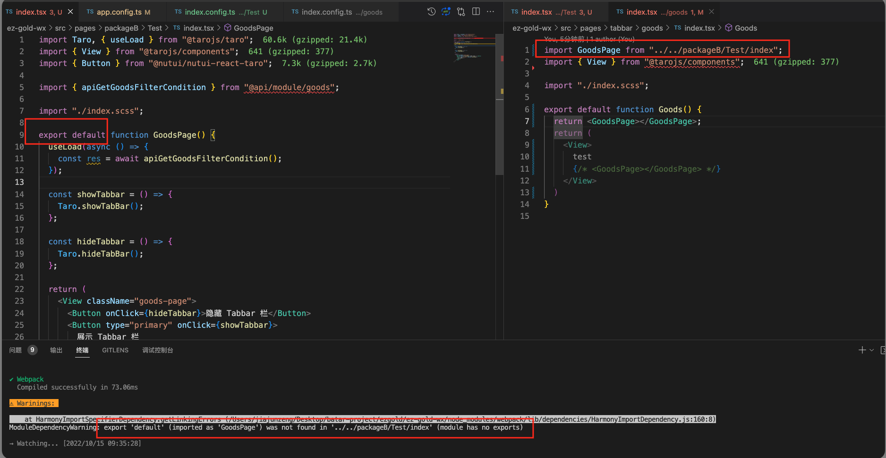

### 【解决方案 1】：导入地方使用 import \* as GoodsPage from ""

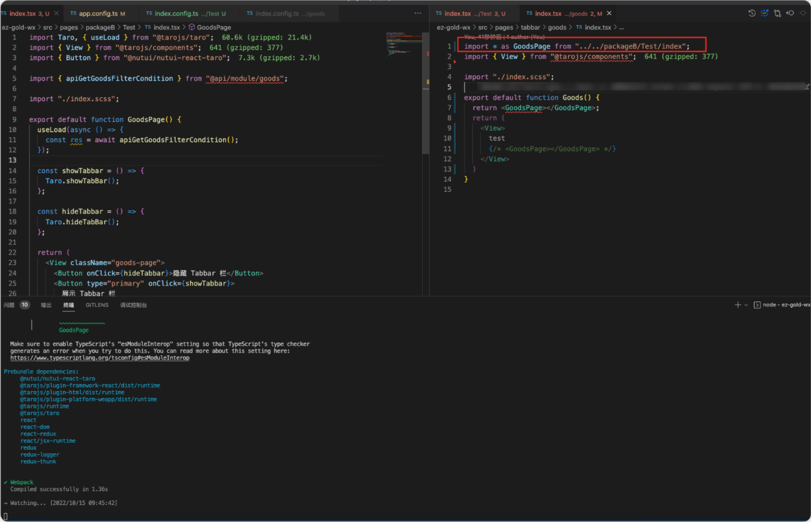

### 【解决方案 1】带来了新的错误提示

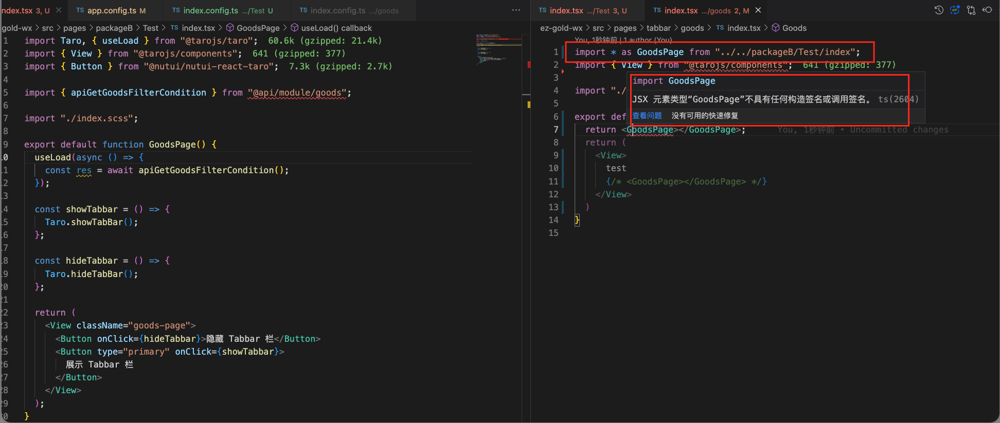

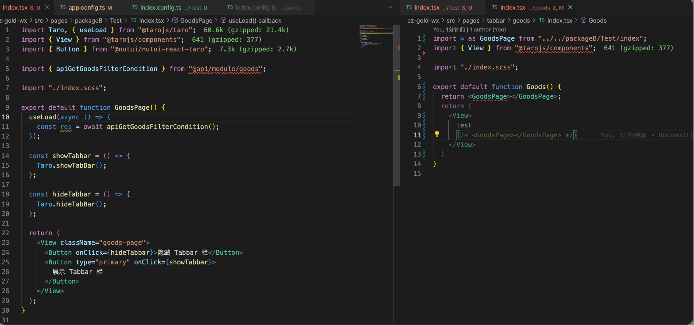

程序正常跑，**微信开发者工具提示重复注册页面了**

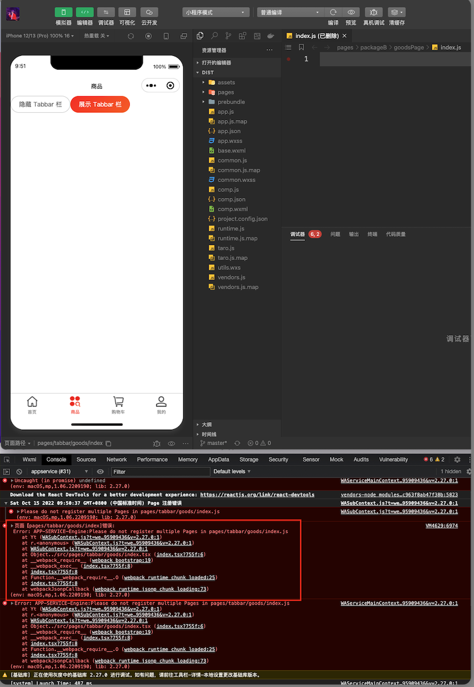

### 网友解决方案

[网友解决方案](https://www.cnblogs.com/web1/p/9232410.html)

没有解决本次问题

### 最终解决方案

一开始以为是 goods 跟 goodsPage 会有冲突，把文件夹改成了 Test 还是会

**问题出现：可能是因为 【页面组件】 导入了 【页面组件】**

**解决方案：把 公用代码 抽取成组件，而不是页面**

## 编译体积过大

### 问题背景

开发过程中，手机预览，主包体积过大。

### 解决方案

#### **2.4M**

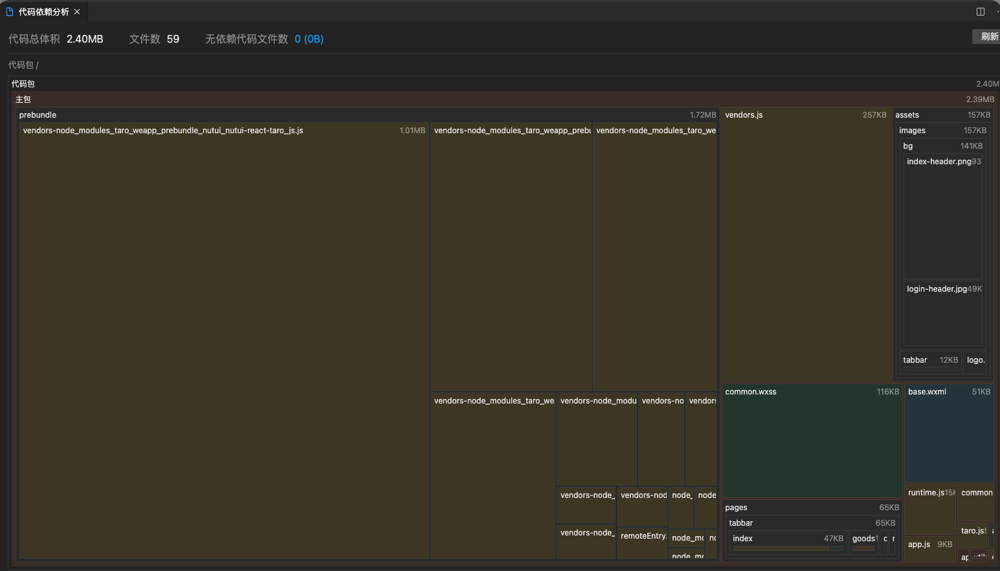

1. 关闭 prebundle

```javascript
compiler: {
  type: "webpack5",
    // 仅 webpack5 支持依赖预编译配置
    prebundle: {
    enable: false
  }
},
```

#### **1.09M**

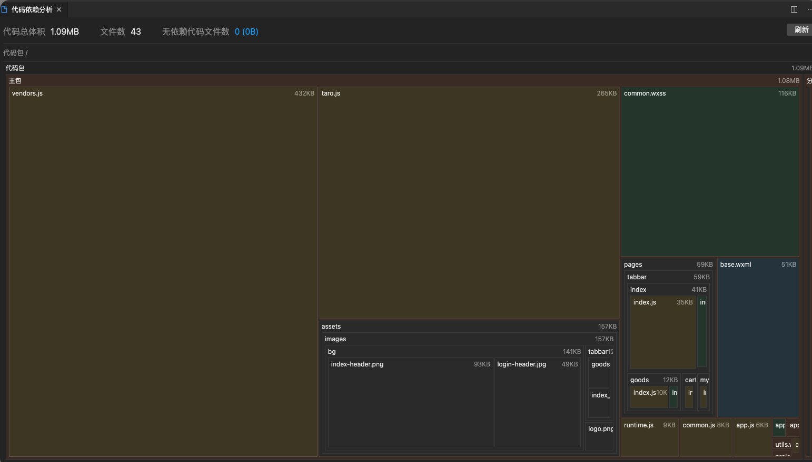

1. npm install --save-dev thread-loader cache-loader taro-plugin-compiler-optimization

```javascript

plugins: ["@tarojs/plugin-html", "taro-plugin-compiler-optimization"],
```

```javascript
export const mini = {
  webpackChain: (chain) => {
    chain.merge({
      plugin: {
        install: {
          plugin: require("terser-webpack-plugin"),
          args: [
            {
              terserOptions: {
                compress: true, // 默认使用terser压缩
                // mangle: false,
                keep_classnames: true, // 不改变class名称
                keep_fnames: true, // 不改变函数名称
              },
            },
          ],
        },
      },
    });
  },
};
```

#### 700K


目前开发编译速度正常，打包(build)正常

## 参考链接

1. [https://www.cnblogs.com/web1/p/9232410.html](https://www.cnblogs.com/web1/p/9232410.html)
2. [小程序编译优化指南 | Taro 文档](https://docs.taro.zone/docs/compile-optimized)
3. [依赖预加载 | Taro 文档](https://docs.taro.zone/docs/prebundle)

## debug 过程

[小程序编译优化指南 | Taro 文档](https://docs.taro.zone/docs/compile-optimized)，

发现打包产物 prebundle 体积很大，[依赖预加载 | Taro 文档](https://docs.taro.zone/docs/prebundle)

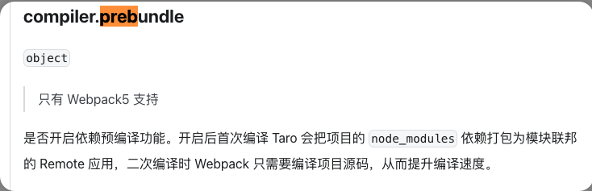

将该属性设置为 false

后来发现 nutui-react-taro 文件过大 （1M
把 UI 框架剔除后重新打包，体积减少一半，当然这不是解决方案，UI 框架是必须要有的

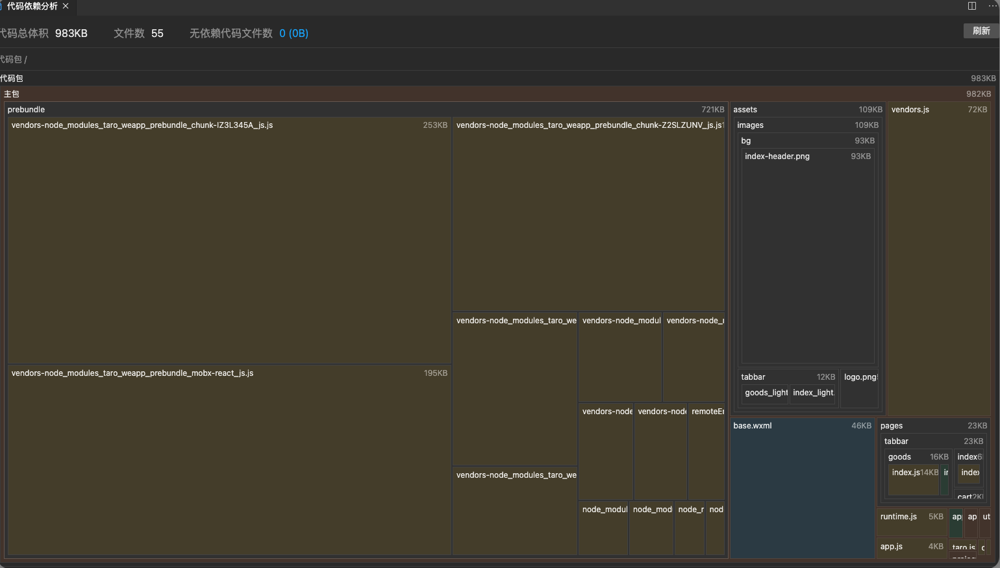

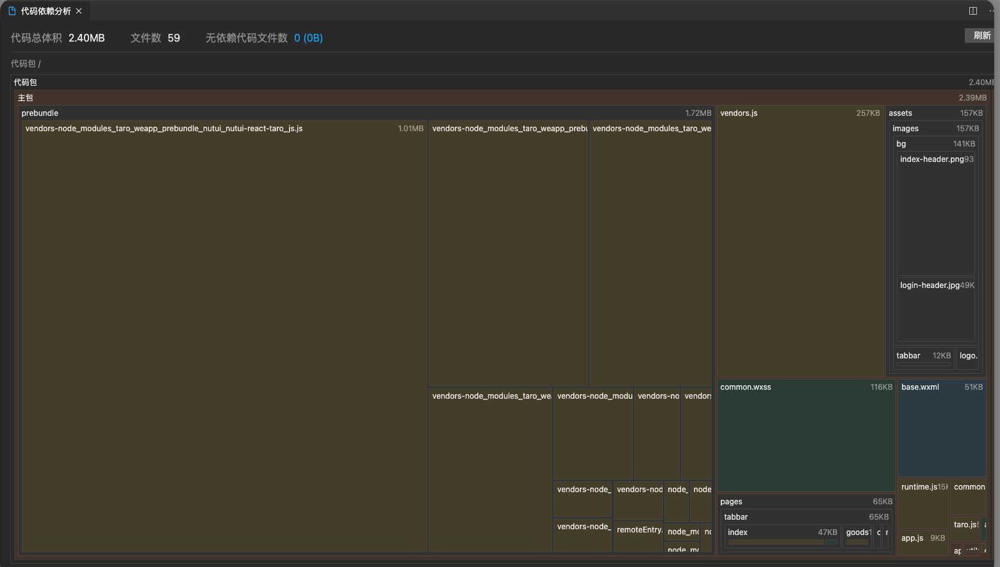

按照官网配置 terser-webpack-plugin，体积减少 200K

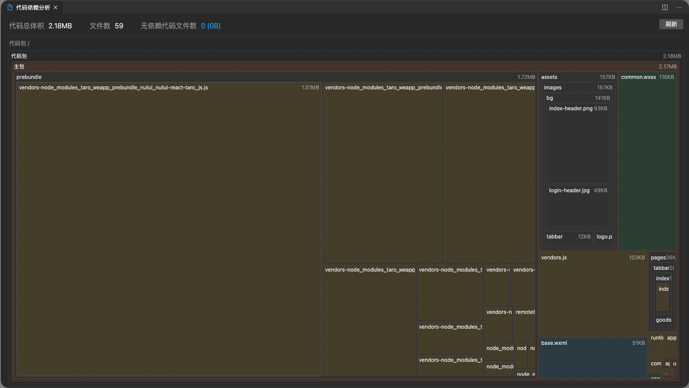
